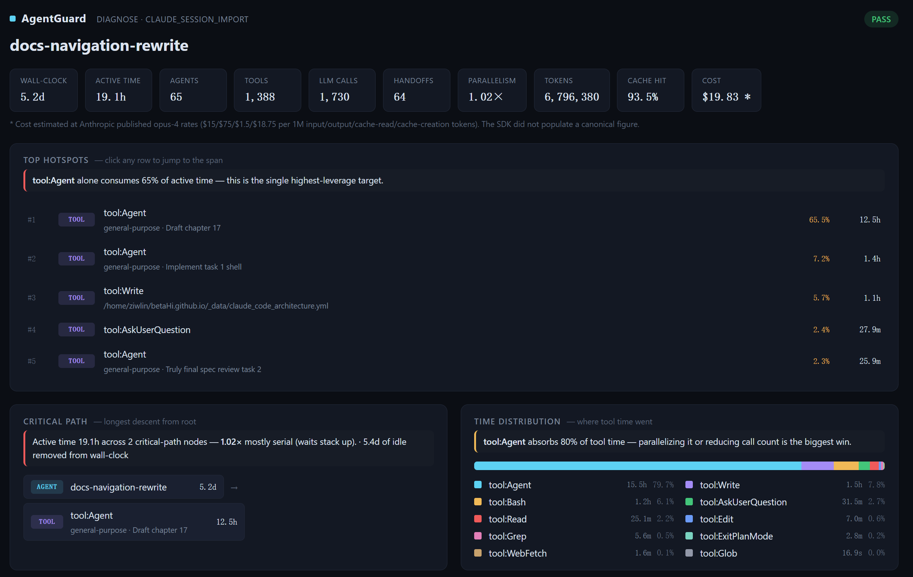
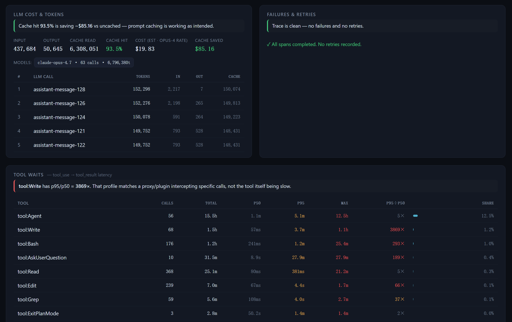
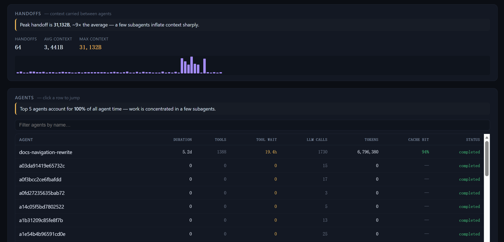

<div align="center">

# AgentGuard

**Diagnostics for multi-agent orchestration.**

*Find the bottleneck agent, the lossy handoff, the failure that propagated, and the run that cost a lot but yielded little.*

[](https://opensource.org/licenses/MIT)
[](https://www.python.org/downloads/)

</div>

<p align="center">
  
</p>

---

## What it does

AgentGuard turns one agent run into a structured trace and answers five questions about it:

1. Which agent was the bottleneck?
2. Which handoff lost information?
3. Which failure started propagating?
4. Which path cost a lot and yielded little?
5. Which orchestration decision degraded the run?

Each card in the report carries a one-line verdict so you can read it top-to-bottom without digging for numbers.

<p align="center">
  
</p>

<p align="center">
  
</p>

## Install

One prerequisite — [`uv`](https://docs.astral.sh/uv/), the cross-platform Python installer:

```bash
curl -LsSf https://astral.sh/uv/install.sh | sh
```

Then pick the entry point you'll actually use:

| | Command |
|---|---|
| **Claude Code plugin** | Two slash-commands inside Claude Code (entry point A below). The plugin runs `uv tool install` on first session. |
| **CLI** | `curl -sSL https://raw.githubusercontent.com/betaHi/AgentGuard/main/install.sh \| bash` |
| **Python API** | `uv tool install "git+https://github.com/betaHi/AgentGuard.git" --with claude-agent-sdk` |

All three paths install `agentguard` + `claude-agent-sdk`. Skip the SDK with `AGENTGUARD_NO_SDK=1`.

## Use it — three entry points

Pick the one that matches how you already work.

### A. Claude Code plugin (in-editor, recommended)

Two lines inside Claude Code:

```text
/plugin marketplace add betaHi/AgentGuard
/plugin install agentguard@agentguard
```

First session runs a one-time `uv tool install` to put `agentguard` + `claude-agent-sdk` on your system.
Have the repo cloned? `claude --plugin-dir ./plugins/agentguard-claude-code` still works for local iteration.

Once installed, the plugin exposes:

| Slash command | What it does |
|---|---|
| `/agentguard:list-sessions` | List every Claude session across all projects, grouped by cwd |
| `/agentguard:diagnose-session` | Diagnose a session; prompts you to pick one if you don't pass an id |
| `/agentguard:diagnose-session <session-id>` | Diagnose the given session directly |
| `/agentguard:diagnose-trace <trace.json>` | Re-analyze a saved trace |

**Auto-diagnosis on session end.** A `SessionEnd` hook runs `diagnose-claude-session` in the background and writes artifacts under `.agentguard/` in the project directory:

```text
.agentguard/traces/<session-id>.json      # captured trace
.agentguard/reports/<session-id>.html     # HTML report
.agentguard/reports/<session-id>.txt      # dense terminal diagnosis
```

The hook never blocks the session. Auto-install can be disabled with `AGENTGUARD_AUTO_INSTALL=0`; install logs land in `~/.local/state/agentguard/bootstrap.log`.

Plugin details: [plugins/agentguard-claude-code/README.md](plugins/agentguard-claude-code/README.md).

### B. CLI, any shell

For diagnosing Claude sessions from a terminal without Claude Code running:

```bash
agentguard list-claude-sessions --limit 10
agentguard diagnose-claude-session <session-id> \
    --output .agentguard/traces/session.json \
    --report-output .agentguard/report.html
```

If the session can't be found automatically, pass the project dir:

```bash
agentguard list-claude-sessions --all --group-by-project
agentguard diagnose-claude-session <session-id> --directory /path/to/project
```

### C. Your own Python agents

Decorate agents and tools; the trace and report are produced the same way.

```python
import agentguard
from agentguard import record_agent, record_tool
from agentguard.sdk.recorder import init_recorder, finish_recording

agentguard.configure(output_dir=".agentguard/traces", auto_thread_context=True)

@record_tool(name="search")
def search(q: str) -> list[dict]: ...

@record_agent(name="researcher")
def researcher(topic: str) -> dict:
    return {"results": search(topic)}

init_recorder(task="research")
researcher("agent diagnostics")
trace = finish_recording()
```

Or wrap a live Claude SDK client:

```python
from claude_agent_sdk import ClaudeSDKClient
from agentguard.runtime.claude import wrap_claude_client
from agentguard.web.viewer import generate_report_from_trace

async with wrap_claude_client(ClaudeSDKClient()) as client:
    await client.query("Refactor the auth module")
    async for _ in client.receive_response():
        pass
    trace = client.agentguard_trace()

generate_report_from_trace(trace, output=".agentguard/report.html")
```

Runnable example: [examples/minimal.py](examples/minimal.py).

## Reading the report

- **Hotspots** — top-N spans by duration, with root and pass-through wrappers filtered out.
- **Critical path** — longest descent from root; each node is clickable and jumps into the tree.
- **Time distribution** — where tool time actually went.
- **LLM cost & tokens** — estimated $ at opus-4 rates when the SDK didn't populate cost, plus cache-hit savings.
- **Tool waits** — calls, p50, p95, max, and `p95÷p50` amplification (high amp = a proxy/plugin intercepting specific calls, not the tool being slow).
- **Handoffs** — context-size sparkline across handoffs.
- **Agents** — sortable, searchable per-agent scorecard (duration, tool wait, LLM calls, tokens, cache hit).
- **Execution tree** — the full topology, clickable from any card above.

## Other CLI commands

| Command | Purpose |
|---|---|
| `agentguard diagnose <trace.json>` | Dense terminal diagnosis of a saved trace |
| `agentguard report --dir .agentguard/traces` | Build an HTML report from multiple traces |
| `agentguard analyze <trace.json>` | Failure propagation + flow analysis |
| `agentguard learn <trace.json>` | Extract lessons from repeated runs |
| `agentguard --help` | Full command list |

## What a trace captures

Agents, tools, subagents, LLM calls, handoffs, token usage, cache hit/miss, tool-wait latency (tool_use → tool_result), timestamps, parent/child topology. Claude sessions additionally preserve real wall-clock timings and usage tokens recovered from the JSONL side-channel the SDK does not expose.

## Boundaries

- Not a generic LLM-observability platform — works **above** token tracing, on the orchestration layer.
- Not an agent framework — diagnoses runs produced by the framework you already use.
- Local-first — JSON traces on disk, single-file HTML report, no service required.

## Documentation

- [Getting started](docs/getting-started.md)
- [Architecture](docs/architecture.md)
- [API reference](docs/api-reference.md)
- [Examples](docs/examples.md)

## License

MIT — see [LICENSE](LICENSE).
