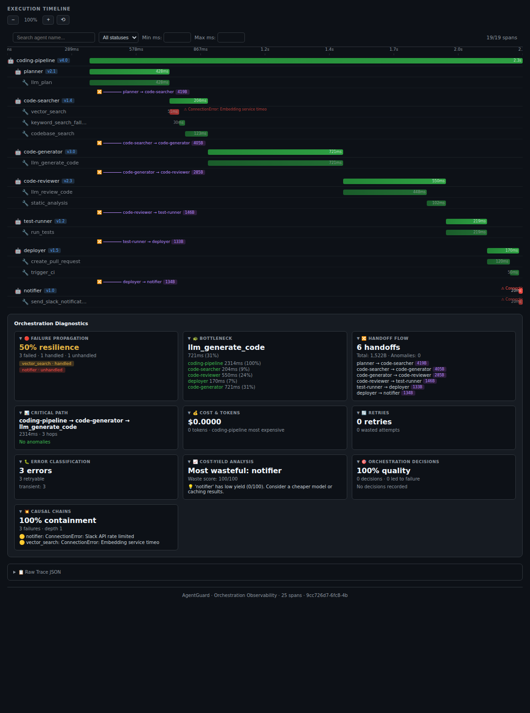
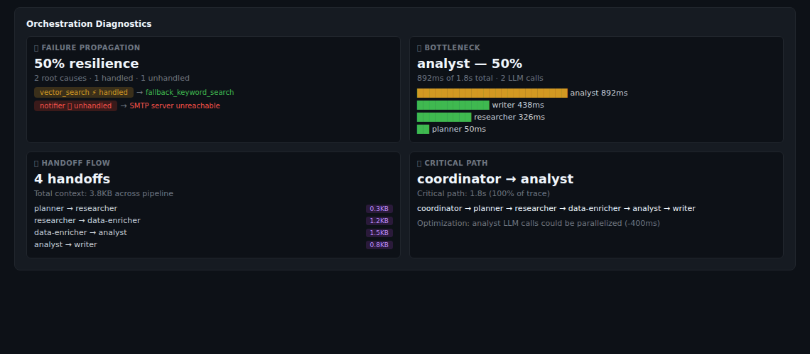
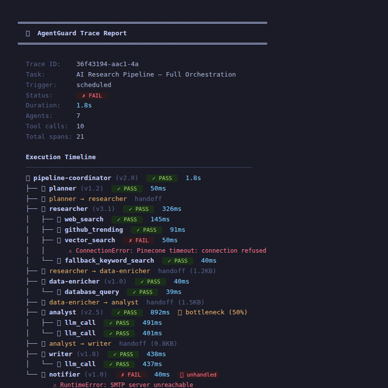
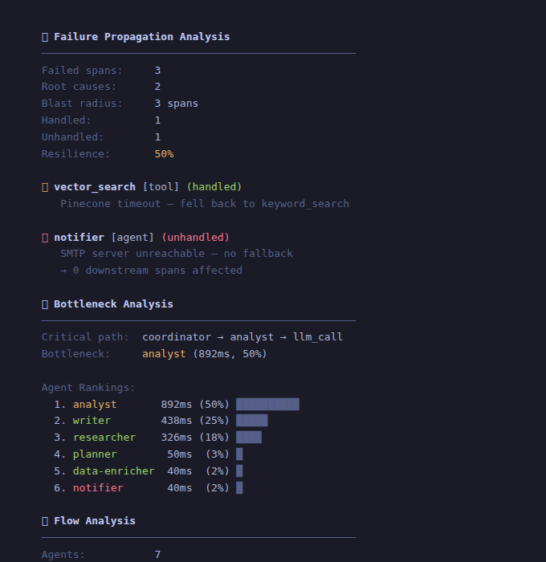

<div align="center">

# 🛡️ AgentGuard

**Observability for multi-agent orchestration.**

*See how your agents collaborate, where they fail, and why.*

[](https://opensource.org/licenses/MIT)
[](https://www.python.org/downloads/)
[](https://github.com/betaHi/AgentGuard/actions/workflows/test.yml)

</div>

---

## What Is This

Existing tools (Langfuse, Phoenix, etc.) show you what happens inside a single LLM call — tokens, latency, cost. That's valuable, but it doesn't answer the harder questions:

- Which agent in my pipeline is the bottleneck?
- When agent A hands off to agent B, does context survive?
- A tool failed — did the failure propagate or get handled?
- My coordinator dispatched 3 sub-agents — who did what, in what order?

**AgentGuard is an observability layer specifically for multi-agent orchestration.** It captures the execution topology of your agent system — the agents, tools, handoffs, and their relationships — as structured traces.

## Screenshots

### Orchestration Timeline

<p align="center">
  
</p>

> Gantt-style timeline with sidebar agent health, handoff context sizes, bottleneck annotation, and failure propagation. Generated by `agentguard report`.

### Orchestration Diagnostics

<p align="center">
  
</p>

> Four diagnostic panels powered by `agentguard/analysis.py`: failure propagation, bottleneck, handoff flow, and critical path. Generated by `agentguard report`.

### CLI Trace & Analysis

<p align="center">
  
</p>
<p align="center">
  
</p>

## Example: Multi-Agent Coding Pipeline

The included demo (`examples/coding_pipeline.py`) models a realistic AI coding agent:

```
coding-pipeline (coordinator)
├── planner          — LLM breaks user request into subtasks
├── code-searcher    — vector search + codebase search (with fallback)  
├── code-generator   — LLM writes implementation
├── code-reviewer    — LLM reviews + static analysis
├── test-runner      — executes test suite
├── deployer         — creates PR + triggers CI
└── notifier         — sends Slack notifications (may fail)
```

8 agents, 11 tools, 6 handoffs, simulated failures with fallback patterns.
Modeled after the kind of pipeline behind Cursor, Copilot Workspace, and Claude Code.

### Example: Parallel Research Pipeline (`examples/parallel_pipeline.py`)

```
research-pipeline (coordinator)
├── [PARALLEL] web_researcher        — searches web (3 results)
├── [PARALLEL] academic_researcher   — searches arxiv (2 papers)
├── [PARALLEL] social_researcher     — searches social (may fail)
│
├── [SEQUENTIAL] merger              — combines all results
├── [SEQUENTIAL] analyst             — LLM analysis
└── [SEQUENTIAL] writer              — writes report
```

3 researchers run **concurrently** (real threads, real timing overlap), then results merge sequentially.
Social researcher gracefully degrades on API failures (circuit breaker pattern).

### Example: Parallel Code Review (`examples/parallel_coding.py`)

```
coding-pipeline (coordinator)
├── planner          → code-generator
├── [PARALLEL] code-reviewer      — LLM quality review
├── [PARALLEL] security-scanner   — vulnerability scan
├── [PARALLEL] test-runner        — pytest execution
│
├── fixer            — fixes issues from all 3
└── deployer         — creates PR
```

Review, security scan, and tests run **in parallel** after code generation.

## Core: The Trace

Everything in AgentGuard is built on one data model — the **multi-agent execution trace**.

```
Trace: "AI Research Pipeline" (cron, 1.2s)
│
├── 🤖 coordinator (v1.0)           1.2s  ✓
│   ├── 🤖 news-collector (v1.3)    412ms ✓
│   │   ├── 🔧 web_search           186ms ✓
│   │   └── 🔧 github_api           92ms  ✓
│   ├── 🤖 analyst (v2.0)           534ms ✓
│   │   ├── 🔧 web_search           215ms ✓
│   │   └── 🔧 llm_summarize        178ms ✓
│   └── 🔧 llm_summarize            143ms ✓
```

A trace captures:
- **Agent spans** — who ran, what version, how long, success or failure
- **Tool spans** — what tools each agent called, with inputs/outputs
- **Parent-child relationships** — which agent called which tool, which coordinator dispatched which sub-agent
- **Failure propagation** — did an error get caught, retried, or bubble up?
- **Cross-process spans** — agents spawned via subprocess/multiprocessing join the same trace

This trace is the foundation. Everything else — evaluation, comparison, monitoring — is built on top of it.

## Instrumentation

Six ways to capture traces, from least to most intrusive:

### 1. Decorators (2 lines)

```python
from agentguard import record_agent, record_tool

@record_agent(name="researcher", version="v1.3")
def research(topic: str) -> dict:
    results = search(topic)
    return {"results": results}

@record_tool(name="web_search")
def search(query: str) -> list:
    return call_api(query)  # your code, unchanged
```

### 2. Context Managers (zero decoration)

```python
from agentguard import AgentTrace

with AgentTrace(name="researcher", version="v1.3") as agent:
    with agent.tool("web_search") as t:
        results = call_api(query)
        t.set_output(results)
    agent.set_output({"results": results})
```

### 3. Async

```python
from agentguard import record_agent_async, record_tool_async

@record_agent_async(name="researcher", version="v1.0")
async def research(topic):
    return await search(topic)
```

### 4. Spawned Processes

```python
from agentguard.sdk.distributed import inject_trace_context, init_recorder_from_env

# Parent
env = inject_trace_context(parent_span_id=coordinator_span_id)
subprocess.run(["python", "agent_a.py"], env={**os.environ, **env})

# Child (agent_a.py)
init_recorder_from_env()  # joins parent trace automatically
```

### 5. Middleware (wrap existing code)

```python
from agentguard.sdk.middleware import wrap_agent, patch_method

traced_fn = wrap_agent(existing_fn, name="agent", version="v1")
# or
patch_method(ThirdPartyAgent, "run", agent_name="agent")
```

### 6. Manual API (full control)

```python
from agentguard.sdk.manual import ManualTracer

tracer = ManualTracer(task="Pipeline")
a = tracer.start_agent("coordinator", version="v1")
t = tracer.start_tool("search", parent=a)
tracer.end_tool(t, output=results)
tracer.end_agent(a, output=final)
trace = tracer.finish()
```

## Built On Top of Traces

Once you have traces, AgentGuard provides tools to analyze them:

### Evaluation Rules

```python
from agentguard.eval.rules import evaluate_rules

rules = [
    {"type": "min_count", "target": "articles", "value": 5},
    {"type": "each_has", "target": "articles", "fields": ["title", "url"]},
    {"type": "recency", "target": "articles.date", "within_days": 2},
]
results = evaluate_rules(agent_output, rules)
```

8 built-in rule types: `min_count`, `max_count`, `each_has`, `recency`, `no_duplicates`, `contains`, `regex`, `range`

### Version Comparison

```python
from agentguard.eval.compare import compare_evals
result = compare_evals(baseline, candidate)
print(result.recommendation)  # "safe_to_deploy" or "review_before_deploy"
```

### Replay & Regression

```python
from agentguard.replay import ReplayEngine
engine = ReplayEngine()
engine.save_baseline("test-1", input_data={...}, output_data={...}, rules=[...])
result = engine.compare("test-1", candidate_output=new_output)
```

### Self-Reflection & Evolution

```python
from agentguard.evolve import EvolutionEngine

engine = EvolutionEngine()
engine.learn(trace)  # extract lessons, accumulate knowledge

# After multiple runs:
suggestions = engine.suggest()
# → "notifier has 5 unhandled failures — add retry mechanism" (95% confidence)

trends = engine.detect_trends()
# → "researcher is a persistent bottleneck (seen 8 times)"
```

Knowledge accumulates across runs in `.agentguard/knowledge/`. Repeated patterns increase confidence. Inspired by [A-MEM](https://github.com/agiresearch/A-mem) (Zettelkasten-style agentic memory).

### Continuous Monitoring

```python
from agentguard.guard import Guard, StdoutAlert, WebhookAlert
guard = Guard(alert_handlers=[StdoutAlert(), WebhookAlert(url)])
guard.watch(interval=300)
```

### Export

```python
from agentguard.export import export_otel_spans, export_jsonl
otel_spans = export_otel_spans(trace)  # send to any OTel collector
export_jsonl(trace, "output.jsonl")    # for log aggregation
```

## CLI

```bash
agentguard show <trace.json>                      # display trace tree
agentguard list [--dir DIR]                       # list traces
agentguard search [--name X] [--type agent|tool]  # search spans across traces
agentguard eval <trace.json> [--config cfg.json]  # evaluate against rules
agentguard merge <parent.json>                    # merge distributed child traces
agentguard validate <trace.json>                  # check trace integrity
agentguard diff <trace_a> <trace_b>               # compare two traces
agentguard analyze <trace.json>                   # failure + bottleneck + flow + timing + cost
agentguard report [--dir DIR]                     # generate HTML orchestration panel
agentguard guard [--dir DIR] [--interval 60]      # continuous monitoring
```

## Design

| Principle | How |
|---|---|
| **Observability-first** | Trace is the core. Eval/replay/guard are built on traces. |
| **Multi-agent native** | Parent-child spans, cross-process propagation, handoff tracking |
| **Low intrusion** | 6 integration styles — pick what fits your architecture |
| **Zero dependencies** | Core SDK uses only Python stdlib |
| **Local-first** | JSON files on disk. No cloud, no DB, no Docker. |
| **Framework-agnostic** | Works with any agent system |

## What This Is Not

- **Not an LLM observability platform** — Use Langfuse/Phoenix for token-level tracing. AgentGuard works above that layer.
- **Not an agent framework** — Use LangChain/CrewAI/etc. to build agents. AgentGuard observes them.
- **Not a testing framework** — Eval rules are secondary to the trace. The trace is the product.

## Architecture

```
Your Agents → AgentGuard SDK → Traces (JSON) → Analysis + Evolution
                                    │
                    ┌───────────────┼───────────────┐
                    ▼               ▼               ▼
              CLI (30+ commands)  Web panel       Evolve engine
              Guard mode       Eval/Replay     OTel export
```

See [docs/architecture.md](docs/architecture.md) for details.


## Key Features

| Category | Features |
|----------|----------|
| **Instrumentation** | 6 integration styles (sync/async decorators, context managers, manual API, middleware, distributed) |
| **Handoff Tracking** | Context usage tracking, utilization ratio, degradation analysis, integrity scoring |
| **Context Transforms** | Summarization detection, filtering, type changes, key renames across handoffs |
| **Failure Analysis** | Causal chains, circuit breaker detection, blast radius, recoverable vs fatal severity |
| **Bottleneck** | Critical path analysis, false bottleneck detection (agent waiting on deps vs doing work) |
| **Cost-Yield** | Per-agent cost/yield ratio, custom cost functions, waste detection, recommendations |
| **Decisions** | Orchestration decision quality scoring, optimal agent suggestions from trace history |
| **Flow Graph** | DAG visualization, parallel/sequential detection, critical path, Mermaid export |
| **Context Flow** | Compression/truncation events, bandwidth analysis, bottleneck detection |
| **Correlation** | Span fingerprinting, failure-handoff causality, pattern detection |
| **Scoring** | 5-component quality score (A-F grade), performance benchmarking |
| **Profiling** | Per-agent stats across traces, error patterns, interaction mapping |
| **A/B Testing** | Compare agent versions, regression detection |
| **Timeline** | Chronological event stream, filtering by type/span |
| **Trace Builder** | Fluent API for constructing test/synthetic traces |
| **SDK** | Fail-open decorators, per-trace sampling, span annotations, correlation IDs, batch export |
| **Production** | , trace size limits (10MB warn, 100KB/field truncation), batch I/O |
| **Viewer** | Interactive HTML: collapsible panels, search/filter by name/status/duration, 9 diagnostic panels |
| **Storage** | File-based store with query, prune, and schema validation |
| **CLI** | 33 commands: show, analyze, diff, summary, score, aggregate, timeline, metrics, and more |
| **Export** | JSON, JSONL, OTel, Prometheus text format |

**1170+ tests • 20 examples • Zero external dependencies for core**

## Install

```bash
pip install agentguard
```

## Contributing

See [CONTRIBUTING.md](CONTRIBUTING.md). Issues and PRs welcome.

## License

MIT
